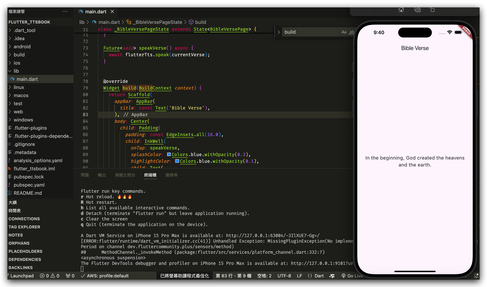

這是一份面試考題實作

> [!NOTE] 題b
> App打開後，隨機讀取一段聖經的經文api
> https://bible-api.com
> 在App內，當手指點擊經文後，TTS（語音合成技術）會朗讀該經文。
>
搖一搖會換一批經文 

約翰福音3章16節：https://bible-api.com/john 3:16
創世記1章1節：https://bible-api.com/genesis 1:1
詩篇23篇1節：https://bible-api.com/psalms 23:1

